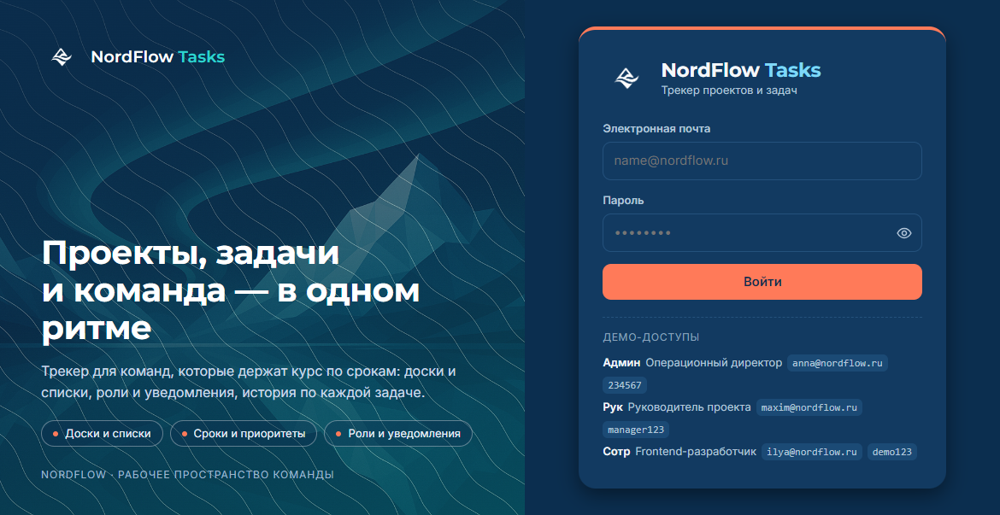

<div align="center">

# 👋 Привет, я Helga

### Вайб-кодер: от лендингов до полноценных CRM-систем

[](https://github.com/helga2026)
[](https://github.com/helga2026)

</div>

---

## 🌊 О себе

Я создаю продукты через **вайб-кодинг** — метод, где идея превращается в работающий код за часы, а не за недели.

Вместо бесконечных созвонов и водопадных спринтов — живой диалог с ИИ, быстрые итерации и фокус на результате. Я чувствую ритм проекта: понимаю, когда пора рефакторить, когда — релизить, а когда — просто отпустить и начать следующее.

> **Обо мне в двух словах:** я не просто пишу код — я строю продукт, который работает. Вайб-кодинг — это про поток, про чувство проекта: в итоге получается что-то настоящее. От идеи до релиза без лишних шагов.

**Что меня мотивирует:** видеть, как сырая идея через пару вечеров превращается в живой продукт, которым пользуются люди.

---

## 🛤️ Мой путь

Всё началось с первого бота — а потом с лендинга, собранного вместе с ИИ. Меня поразил результат: он появлялся быстро и получался сразу хорошим. А ещё понравилось то, что ИИ — это по-настоящему **человеческое общение**: диалог, в котором тебя слышат и предлагают варианты.

С тех пор вайб-кодинг стал моим способом создавать: от идеи до работающего продукта — за один вечер.

> ⭐ **Первый особенный опыт** — ИИ-агент контент-мейкер на Coze: красивая архитектура, подключённые базы знаний и библиотеки, интеграция с Telegram. Проект, после которого я уверена: сложные вещи тоже собираются.

---

## 🛠️ Что я делаю

<table>
<tr>
<td width="50%">

### 🌐 Сайты и лендинги
- Промо-страницы и лендинги под конверсию
- Корпоративные сайты и портфолио
- Блоги и медийные проекты
- Адаптивная вёрстка и внимание к деталям

</td>
<td width="50%">

### 🗄️ CRM-системы
- Воронки продаж и управление лидами
- Внутренние панели для команд
- Автоматизация рутинных процессов
- Отчёты, аналитика и интеграции

</td>
</tr>
<tr>
<td width="50%">

### ⚡ Прочее
- Мини-приложения и боты
- MVP для стартапов и проверки гипотез
- Парсеры и автоматизация данных
- Эксперименты с AI и LLM

</td>
<td width="50%">

### 🧭 Мои принципы
1. **Скорость** — лучше рабочий MVP сегодня, чем идеальный через полгода
2. **Фокус на задаче** — строю то, что решает проблему, а не то, что красиво выглядит
3. **AI как партнёр** — использую Claude, GPT и другие инструменты как со-разработчиков
4. **Итерации** — запускаю быстро, улучшаю по обратной связи
5. **Минимализм** — никакого лишнего кода и функций, которые не нужны

</td>
</tr>
</table>

---

## ⚙️ Как я работаю

Каждый проект — по этапам, без хаоса:

1. **Идея** — обсуждаю варианты с ИИ и выбираю подходящий
2. **Анализ** — прогоняю сценарии, понимаю, что должно работать
3. **Архитектура** — строю структуру до того, как писать код
4. **Итерации и тестирование** — собираю, ломаю, чиню, повторяю
5. **MVP готов** — результат нравится, продукт не ломается ✅

> 🔥 **Что было сложнее всего:** подключить Claude. А в проектах, где приходилось делать несколько итераций, чтобы довести MVP до рабочего состояния, в основном не хватало опыта и технических навыков в работе с различными программами — но каждый проект этот опыт добавлял.

---

## 📂 Избранные проекты

| 🚀 Проект | 📝 Описание | 🛠️ Стек |
|:---|:---|:---|
| **[digital-showcase](https://github.com/helga2026/digital-showcase)** | Сайт-визитка фрилансера: портфолио, Apple-стиль, переход в Telegram | `React` `TypeScript` `Tailwind` |
| **[psychologist-landing](https://github.com/helga2026/psychologist-landing)** | Лендинг психолога: спокойный дизайн, блок доверия, форма записи | `React` `TypeScript` `Tailwind` |
| **[photographer-landing](https://github.com/helga2026/photographer-landing)** | Лендинг фотографа: портфолио-галерея, booking-блок | `React` `TypeScript` `Tailwind` |
| **[dressbook-style](https://github.com/helga2026/dressbook-style)** | DressBook Style — лендинг о стиле и моде | `React` `TypeScript` `Tailwind` |
| **[speak-bright-english](https://github.com/helga2026/speak-bright-english)** | Лендинг репетитора по английскому: заявки на пробное занятие | `React` `TypeScript` `Tailwind` |
| **[smart-china-sourcing](https://github.com/helga2026/smart-china-sourcing)** | SinoSmartBuyer — лендинг байера на китайских маркетплейсах | `React` `TypeScript` `Tailwind` |
| **[vet-health-center](https://github.com/helga2026/vet-health-center)** | Лендинг ветеринарного центра VetHealthCenter: услуги, запись, контакты | `React` `TypeScript` `Tailwind` |
| **[ai-chat-guardian](https://github.com/helga2026/ai-chat-guardian)** | AI Smart Chat Guardian — лендинг умного AI-модератора для Telegram | `React` `TypeScript` `Tailwind` |
| **[ai-dietolog-bot](https://github.com/helga2026/ai-dietolog-bot)** | AI-диетолог — Telegram-бот с персональными планами питания | `LLM` `Telegram` |
| **[chatbot-beautysalon](https://github.com/helga2026/chatbot-beautysalon)** | «Алина» для Lumi Beauty Studio — чат-бот ВКонтакте для салона красоты: консультации по прайсу, расписание мастеров, запись клиента в Excel, LLM-диалоги | `PowerShell` `VK API` `LLM` |
| **[nordflow-tracker](https://github.com/helga2026/nordflow-tracker)** | NordFlow Tasks — трекер задач и проектов: канбан и списки, таймер, теги и приоритеты, северная палитра NordFlow | `HTML` `CSS` `JavaScript` |
| **[mindbalance](https://github.com/helga2026/mindbalance)** | MindBalance — PWA-трекер ментального здоровья: ежедневный чек-ин, дневник эмоций, медитации, офлайн-режим | `PWA` `HTML` `Service Worker` |
| **[vitamin-tracker](https://github.com/helga2026/vitamin-tracker)** | Веб-трекер витаминов и минералов (MVP): онбординг, дашборд дефицитов, анкета — mobile-first, данные в LocalStorage | `HTML` `LocalStorage` |

> 📌 *Список проектов пополняется — загляните в [мои репозитории](https://github.com/helga2026?tab=repositories), чтобы увидеть всё свежее.*

### 🖼️ В фокусе: NordFlow Tasks

<p align="center">
  
</p>

<p align="center"><i>NordFlow Tasks — рабочее пространство команды: доски и списки, сроки, роли и уведомления. <a href="https://github.com/helga2026/nordflow-tracker">Репозиторий →</a></i></p>

---

## 💻 Технологии

```text
Frontend    : HTML5, CSS3, JavaScript (ES6+), адаптивная вёрстка, mobile-first
Лендинги    : React, TypeScript, Vite, Tailwind CSS, Radix UI
PWA         : Service Worker, manifest.webmanifest, офлайн-режим
Данные      : LocalStorage, работа с API
UI/UX       : дизайн в палитрах (NordFlow, тёмные темы), анимации на CSS
Боты        : PowerShell 5.1, VK Long Poll API, интеграция с LLM (OpenAI-совместимый API)
Инструменты : Git, GitHub, VS Code, DevTools, Lovable
AI          : LLM-интеграции, промпт-инжиниринг, вайб-кодинг
```

<div align="center">


</div>

---

## 📊 GitHub-статистика

<div align="center">


</div>

---

## 🗺️ Что дальше

Планы масштабные — и я иду к них по шагам:

- 🔹 Уверенно освоить **вайб-кодинг, автоматизацию и AI-решения**
- 🔹 Строить **ИИ-ассистентов под задачи бизнеса**
- 🔹 Предлагать компании **сайты и лендинги** — от внутренних инструментов под процессы команд и дашбордов до интеграций с CRM-системами
- 🔹 Делать **от телеграм-ботов до мини-приложений**
- 🔹 Настраивать **воронки и автоворонки прямо в мессенджере**

---

## 📫 Связаться со мной

Есть идея, которую нужно быстро превратить в продукт? Давайте обсудим.

<div align="center">

[](https://t.me/neirohelga)
[](mailto:missdove@mail.ru)
[](https://github.com/helga2026)

</div>

---

## 💡 Совет тем, кто начинает

> Нужно трудиться, не опускать руки при первых трудностях — и быть уверенным, что, имея профессиональных наставников и **ИИ в качестве партнёра-со-разработчика**, всё обязательно получится.

---

<div align="center">

### ⭐ Если тебе нравятся мои проекты — поставь звёздочку репозиторию!

*Сделано с вайбом и любовью к коду* ✨

</div>
